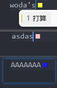

## Features
Shows a real-time sqaure after your caret accroding to your input mode (zh/en/Capslock).

For example if there is an image subfolder under your extension project workspace:

## Extension Settings

For example:

This extension contributes the following settings:

* `myExtension.enable`: Enable/disable this extension.
* `myExtension.thing`: Set to `blah` to do something.

## Known Issues
1. extension.js will call ime_checker.exe.
2. ime_checker.exe is packaged by pyinstaller from ime_checker.py, the exe will listen input mode every 100ms, create a pipe, IPC with extension.js.
3. If you want to change color, feel free to change extension.js.

## Release Notes
Basic functions.

### 1.0.0
Basic functions.

**Enjoy!**
